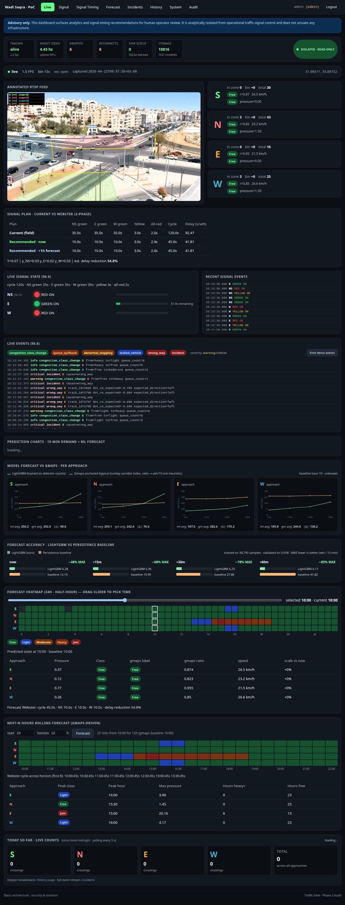
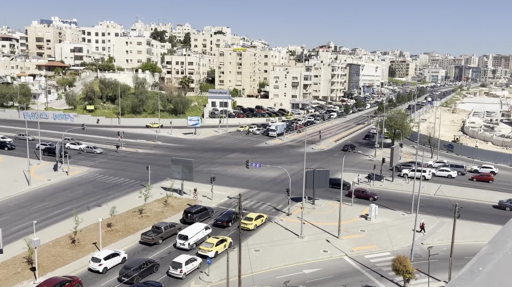
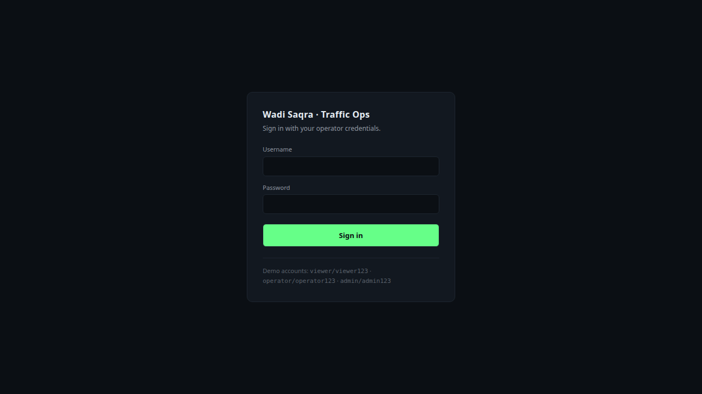
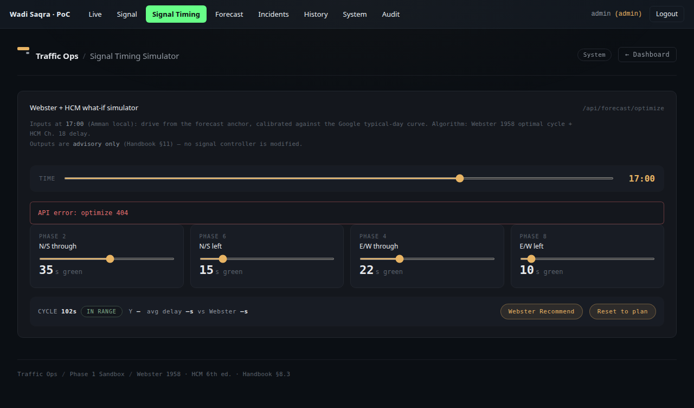
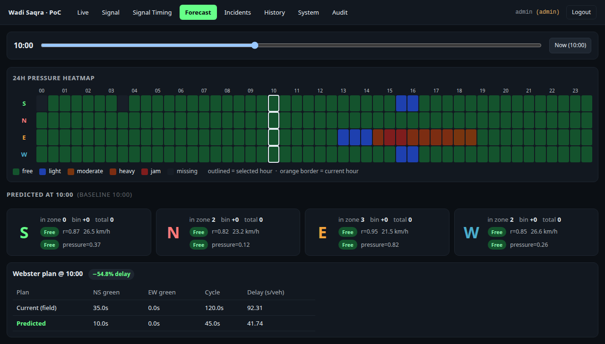
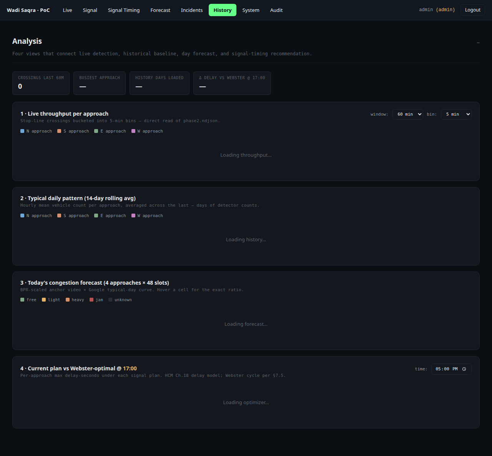

# Traffic-Intel — AI Traffic Intelligence for Wadi Saqra

**9XAI Hackathon build.** A full-stack traffic intelligence PoC for the Wadi Saqra intersection in Amman, Jordan. Live CV detection on an RTSP feed, LightGBM demand forecasting, Google-anchored congestion priors, Webster/HCM signal-timing advisory, and an operator-facing React dashboard — all running on a single port with JWT auth and three-role access control.



## Demo video

[](https://drive.google.com/file/d/1vpw6lIn0ct4-ef6or116nyXB9KHvUT4v/view?usp=drive_link)

Click the thumbnail → Google Drive (≈ 2 min walkthrough of the live app).

## What's shipped

| Module | Status | Notes |
|---|---|---|
| RTSP ingest (MediaMTX + ffmpeg push loop) | ✅ | Source clip → `rtsp://127.0.0.1:8554/wadi_saqra` |
| YOLOv8 detector + BoT-SORT tracker + zone crossings | ✅ | ~7.8 fps on CPU, 4 approaches (S/N/E/W) |
| SQLite store (counts, signals, incidents, audit) | ✅ | 10k+ count rows, 7k+ incidents, 3k+ signal events seeded |
| LightGBM 15-min demand forecast (+now/+15/+30/+60) | ✅ | MAE 6.1–6.4 veh vs. 12–42 persistence baseline |
| Google Maps typical-day congestion prior | ✅ | Read-only NDJSON snapshot, not live API |
| Webster 1958 + HCM Ch. 18 signal-timing advisor | ✅ | Advisory only — §11 of the handbook |
| 3-phase field-observed signal sim (NS → E → W) | ✅ | Video-anchored at `video_ts=23s` when E opens |
| FastAPI + JWT + 3 roles (viewer/operator/admin) | ✅ | HS256, bcrypt, pinned secret via env |
| React SPA served at `/app/` | ✅ | Single-port deploy; dev mode optional on `:3000` |
| MJPEG annotated stream at `/mjpeg` | ✅ | Bounding boxes + approach labels |
| Incident detection (wrong-way, stopped, spillback) | ✅ | 7k+ seeded, classifier verdicts in `data/labels/` |
| Isolation proof (no outbound writes) | ✅ | `scripts/assert_no_outbound_writes.sh`, CI-style gate |

## Screenshots

### Login — bcrypt-checked, JWT issued, role embedded in claims


### Signal Timing — Webster + HCM what-if simulator


### Forecast — 24h pressure heatmap + Webster plan delta


### History / Analysis — connects live detection → forecast → recommendation


## Quickstart

```bash
# 1. Launch everything (MediaMTX, ffmpeg RTSP push, uvicorn, tracker, signal sim)
bash phase3-fullstack/scripts/run_full_stack.sh

# 2. Open the SPA
xdg-open http://localhost:8000/app/

# 3. Sign in
#    admin / admin123      — full access
#    operator / operator123 — dashboard + forecasts + recommendations
#    viewer / viewer123     — read-only live view
```

Everything lives on **`http://localhost:8000`**:

| Path | Purpose |
|---|---|
| `/app/` | React SPA (login, live dashboard, signal-timing sim, forecast, history) |
| `/mjpeg` | Annotated MJPEG stream from the tracker |
| `/api/health` | Tracker FPS, queue depth, storage row counts |
| `/api/auth/login` | POST `{username, password}` → `{token, role, expires_at}` |
| `/api/signal/current` | Current phase, cycle, video-anchor debug fields |
| `/api/forecast/ml` | LightGBM per-approach demand forecast |
| `/api/recommendation` | Webster/HCM advisory plan vs. current |
| `/api/incidents` | Last-24h event stream (wrong-way, stopped, spillback, …) |
| `/api/system/isolation` | Read-only sources + outbound-writes assertion |

OpenAPI at `http://localhost:8000/openapi.json`.

## Architecture

```
RTSP feed (MediaMTX :8554)
        │
        ▼
  ┌─────────────────┐
  │  YOLOv8 + BoT-SORT (tracker)
  │  → zone crossings per approach
  └──────┬──────────┘
         │                 ┌───────────────────────────────┐
         ▼                 │ Google Maps typical-day (NDJSON, read-only)
  ┌────────────┐           └───────────────┬───────────────┘
  │   SQLite   │◀──────────────────────────┘
  │ counts · signals · incidents · audit
  └──┬─────────┬────────────┬──────────────┐
     ▼         ▼            ▼              ▼
   /mjpeg   /api/*   LightGBM forecast   3-phase signal sim
                         (.pkl)           (video-anchored)
                             │
                             ▼
                    Webster 1958 + HCM Ch. 18
                    delay model (advisory only)
                             │
                             ▼
                     React SPA /app/
                     (JWT · 3 roles)
```

Deeper docs:
- [Phase-3 architecture](phase3-fullstack/docs/architecture.md)
- [Algorithms (Webster/HCM, LightGBM, BPR-scaling)](phase3-fullstack/docs/ALGORITHMS.md)
- [Security & isolation model](phase3-fullstack/docs/security_and_isolation.md)
- [Handbook deliverable mapping](phase3-fullstack/docs/HANDBOOK_DELIVERABLE.md)

## Principles

- **Read-only toward operational infrastructure** — no control commands ever, per handbook §11. `scripts/assert_no_outbound_writes.sh` is the gate.
- **Reproducible** — one command launches the full stack from a clean checkout.
- **Open-source only** — MIT / Apache / AGPL-3.0 components; no paid lock-in (handbook §11).
- **Typed contracts** — every API payload has a `frontend/src/api/types.ts` definition.

## Licenses

Application code: MIT. See `phase1-sandbox/methodology.md` for the full open-source component list and their individual licenses (YOLOv8 = AGPL-3.0, MediaMTX = MIT, LightGBM = MIT, FastAPI = MIT, …).

## Phases

| Phase | Status | Dir | Purpose |
|---|---|---|---|
| 1. Sandbox | ✅ | [`phase1-sandbox/`](phase1-sandbox/) | Simulated feeds, SUMO scenarios, synthetic datasets |
| 2. Feasibility | ✅ | [`phase2-feasibility/`](phase2-feasibility/) | YOLOv8 detection, forecasting, dashboard quick builds |
| **3. Full-Stack** | ✅ **shipped** | [`phase3-fullstack/`](phase3-fullstack/) | Integrated live system — this README's subject |
